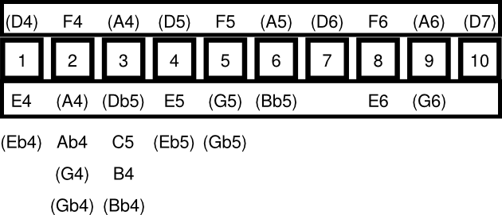

# Harmonica Diagram generator

I happen to own some [Lee Oskar harmonicas of the kind that are tuned to harmonic minor scales](http://leeoskar.com/harmonic-minor-harmonica/). ¡They are lots of fun!

Playing them by ear I mostly improvise tunes that sound like
tango. However these harmonicas are supposed to make it easy to play
Middle Eastern music.

But which arabic scale matches best with my harmonic minor D
harmonica? The following table shows which scale shares the most notes
with the harmonic minor D layout.

|key  | jaccard index  |
|-----|----------------|
|D4   |0.612903225806|
|Db4  |0.428571428571|
|Eb4  |0.470588235294|
|E4   |0.351351351351|
|F4   |0.470588235294|
|Gb4  |0.470588235294|
|G4   |0.282051282051|
|Ab4  |0.315789473684|
|A4   |0.428571428571|
|Bb4  |0.351351351351|
|B4   |0.25|
|C4   |0.388888888889|

Well, it seems the arabic in D matches best, duh.

This is the diagram for the D arabic scale on a harmonic minor D
harmonica, notes in the scale shown in parentheses.

